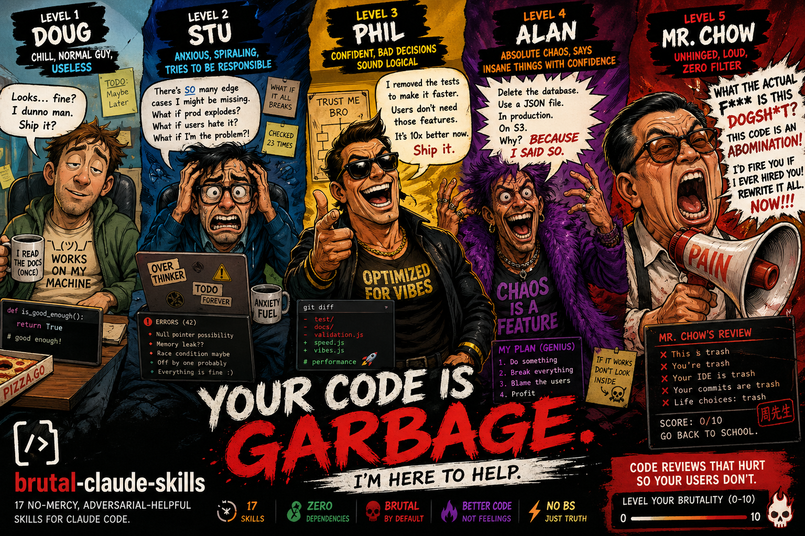

<div align="center">



<br />

# brutal-claude-skills

**18 no-mercy, adversarial-helpful skills for Claude Code.**

Code reviews, roasting, design critiques, devil's advocate, pre-mortems, and more — all designed to make your work better, not your feelings warmer.

[](https://www.npmjs.com/package/brutal-review)
[](https://www.npmjs.com/package/brutal-review)
[](./package.json)
[](./skills)
[](./package.json)
[](./CONTRIBUTING.md)

[Install](#install) · [Skills](#the-skills) · [Usage](#usage) · [Create Your Own](#creating-your-own-skill) · [Contributing](#contributing)

</div>

---

## Why

Claude is, by default, encouraging. That's mostly good. It's also occasionally useless when what you actually need is someone to tell you the truth about your draft, your code, your pitch, your plan, or your "Uber for X" startup idea.

This package installs skills that flip that default. Each skill puts Claude into a focused, adversarial-helpful mode for a specific task. You ask for a brutal code review, you get a brutal code review — not a pep talk.

Every skill stays on the **work**, not the **person**. Hard limits are baked in.

---

## Install

### Option 1: Run directly (no install needed)

```bash
npx brutal-review@latest init
```

> **⚠️ Always use `@latest`** — `npx` caches old versions aggressively. Without `@latest`, you may get a stale version.

### Option 2: Install globally (recommended)

```bash
npm install -g brutal-review

# Now you can just type:
brutal init
brutal help
```

### Option 3: Local development

```bash
git clone https://github.com/premdevai/brutal-claude-skills.git
cd brutal-claude-skills
npm link

# "brutal" command now points to your local code
brutal init
```

Skills install to `~/.claude/skills/` by default (the directory Claude Code reads from).

---

## ⚡ Quick Usage

Once installed, use the killer feature to pipe or paste code directly into a brutal review:

```bash
# Pipe git diff straight to the reviewer
git diff | npx brutal-review use code-reviewer

# Or run interactively (paste your code)
npx brutal-review use architecture-reviewer --level 10
```

*This will automatically launch Claude Code with the correct prompt and your input.*

---

## Command Reference

The CLI uses a clean, one-command mental model: `brutal <action>`. 
*(Note: If installing globally via `npm i -g brutal-review`, you can just type `brutal` instead of `npx brutal-review`)*

```bash
brutal init               # First-time setup (installs engineering pack)
brutal install <skill>    # Install specific skills (alias: i)
brutal use <skill>        # Interactive prompt or piped input
brutal list               # List all skills (alias: ls)
brutal status             # Check installed skills (alias: st)
brutal remove <skill>     # Remove skills (alias: rm)
brutal doctor             # Run diagnostics
brutal export cursor      # Export to Cursor (.cursorrules)
brutal hook git --all     # Install all 3 git hooks
brutal hook github        # Add GitHub Actions PR review
brutal upgrade            # Check for updates
```

---

## Skill Packs

Don't want everything? Install curated bundles:

```bash
brutal install pack <name>
```

| Pack | Skills | What it covers |
| :--- | :---: | :--- |
| **`engineering`** | 6 | Code quality, code reviewer, commit reviewer, design critic, architecture reviewer, web vitals reviewer |
| **`writing`** | 3 | Writing editor, README reviewer, email reviewer |
| **`strategy`** | 4 | Devil's advocate, pre-mortem, assumption auditor, BS detector |
| **`career`** | 2 | Resume reviewer, interview prep destroyer |
| **`growth`** | 4 | SEO reviewer, web vitals reviewer, pitch reviewer, writing editor |
| **`founder`** | 4 | Pitch reviews, writing, architecture, BS detector |
| **`fun`** | 1 | Roast mode |

---

## Team Install (Project Level)

Install skills at the project level so your whole team gets them via git:

```bash
# Install to .claude/skills/ in your current project
brutal install all --project

# Commit to share with your team
git add .claude/skills/ && git commit -m "chore: add brutal claude skills for the team"
```

Check what's installed globally vs. in the current project:

```bash
brutal status
```

---

## The Skills

###  — review your work product

| Skill | What it tears apart |
| :--- | :--- |
| **`code-quality-review`** | Code quality, correctness, maintainability, scalability |
| **`brutal-code-reviewer`** | Code, PRs, diffs — no mercy engineering scrutiny |
| **`brutal-architecture-reviewer`** | System design, service boundaries, infra decisions |
| **`brutal-web-vitals-reviewer`** | LCP, INP, CLS, frontend performance |
| **`brutal-seo-reviewer`** | Semantic HTML, metadata, heading hierarchy, keyword stuffing |
| **`brutal-writing-editor`** | Essays, blog posts, articles, copy |
| **`brutal-design-critic`** | UI, UX, landing pages, Figma designs |
| **`brutal-resume-reviewer`** | Resumes, CVs, cover letters, LinkedIn profiles |
| **`brutal-pitch-reviewer`** | Pitch decks, investor memos, one-pagers |
| **`brutal-readme-reviewer`** | READMEs, docs, API references |
| **`brutal-commit-message-reviewer`** | Git history, PR titles, PR descriptions |
| **`brutal-email-reviewer`** | Professional emails, cold outreach |

###  — interrogate your decisions

| Skill | What it does |
| :--- | :--- |
| **`devils-advocate`** | Argues the strongest possible case *against* any plan |
| **`pre-mortem`** | Imagines the project failed and writes the autopsy |
| **`bs-detector`** | Audits text/claims for vague language, weasel words, unsupported assertions |
| **`assumption-auditor`** | Surfaces the unspoken premises your plan rests on |

###  — survive the real thing

| Skill | What it does |
| :--- | :--- |
| **`interview-prep-destroyer`** | Tears apart practice interview answers, STAR stories, and technical explanations |

###  — pure chaos

| Skill | What it does |
| :--- | :--- |
| **`roast-mode`** | Savage, comedic roast of anything you willingly throw in |

---

## Usage

Once installed, you don't need to do anything special. Each skill has a description that tells Claude when to activate. Just ask naturally:

```
"Review my code"              → brutal-code-reviewer
"Roast my Twitter bio"        → roast-mode
"Play devil's advocate"       → devils-advocate
"What could go wrong?"        → pre-mortem
"Is this BS?"                 → bs-detector
"What am I assuming here?"    → assumption-auditor
"Review my README"            → brutal-readme-reviewer
```

You can also name a skill explicitly if you want a specific one.

### Brutality Scale (0–10)

Every skill supports a **brutality level** from 0 to 10. Default is **7**. Just tell Claude how hard to go:

```
"Review my code, level 3"           → professional, no sarcasm
"Review my code"                    → default (7), savage
"Review my code, go nuclear"        → level 10, profanity unlocked
"Be gentle with this one"           → level 1–2
"Maximum brutality"                 → level 10
"Turn it down"                      → drops 3 levels mid-conversation
```

| Level | Name | Vibe |
| :---: | :--- | :--- |
| 0–2 | **Cool** | Professional 1:1. Honest but no edge. |
| 3–4 | **Blunt** | "This is bad. Here's why." |
| 5–6 | **Harsh** | Sarcastic. Impatient. Cutting. |
| 7–8 | **Savage** | Mocking. Dismissive. Full roast energy. |
| 9–10 | **Nuclear** | Profanity unlocked. Gordon Ramsay mode. |

## 🔗 Integrations — Cover the Entire Dev Cycle

Brutal can embed itself into every stage of your workflow — from keystroke to merged PR.

### Git Hooks (local, per-repo)

Install in one command from inside any git repo:

```bash
# Install all 3 hooks at once
npx brutal-review hook git --all

# Or pick specific hooks
npx brutal-review hook git --commit-msg   # Block lazy commit messages
npx brutal-review hook git --pre-commit   # Scan staged diff for secrets & smells
npx brutal-review hook git --pre-push     # Guard against pushing to main

# Uninstall (non-destructive — restores your originals)
npx brutal-review hook uninstall
```

**What each hook does:**

| Hook | Trigger | Action |
| :--- | :--- | :--- |
| **`commit-msg`** | `git commit` | Blocks lazy messages (`"fix stuff"`, `"wip"`). Offers an inline fix prompt. |
| **`pre-commit`** | `git commit` | Scans staged diff. Blocks secrets & API keys. Warns on TODOs and large diffs. |
| **`pre-push`** | `git push` | Blocks direct pushes to `main`. Catches unresolved conflict markers. |

To skip a hook for a single commit (use carefully):
```bash
git commit --no-verify
```

### GitHub Actions (automated PR review)

```bash
npx brutal-review hook github             # Default level 8
npx brutal-review hook github --level 10  # Nuclear
```

This generates `.github/workflows/brutal-review.yml`. Every PR gets a brutal code review posted as a comment. Old reviews are automatically replaced — no spam.

```bash
git add .github/workflows/brutal-review.yml
git commit -m "ci: add brutal code review workflow"
git push
```

> [!IMPORTANT]
### Export to Cursor & Copilot

You can use these brutal personas in other AI coding assistants. Export them as a `.cursorrules` file for Cursor, or a `.github/copilot-instructions.md` file for GitHub Copilot.

```bash
# Export the engineering pack to Cursor
npx brutal-review export cursor --pack engineering

# Export a specific skill to GitHub Copilot
npx brutal-review export copilot brutal-code-reviewer
```

### Programmatic API

Building a custom PR review bot? An internal Slack integration? You can consume the prompts programmatically via Node.js:

```javascript
const { getSkill, listSkills } = require('brutal-review');

// Get all available skill names
const skills = listSkills();

// Get the raw prompt for a specific skill, overriding the default brutality level
const prompt = getSkill('brutal-code-reviewer', { 
  stripFrontmatter: true, 
  level: 10 
});

console.log(prompt); // Use this in your Anthropic API calls
```

---

## Manual Install (no npm)

```bash
# Clone the repo
git clone https://github.com/premdevai/brutal-claude-skills.git
cd brutal-claude-skills

# Copy the skills you want
cp -r skills/brutal-code-reviewer ~/.claude/skills/
cp -r skills/roast-mode ~/.claude/skills/

# Or copy everything
cp -r skills/* ~/.claude/skills/
```

---

## Uninstall

```bash
# Remove a specific skill
npx brutal-review remove brutal-code-reviewer

# Remove all installed skills
npx brutal-review remove all

# Remove git hooks
npx brutal-review hook uninstall
```

---

## Creating Your Own Skill

Each skill is one folder with one `SKILL.md` file:

```
my-skill/
└── SKILL.md
```

The `SKILL.md` uses YAML frontmatter followed by the skill body in markdown:

```yaml
---
name: my-skill
description: A one-line description. This is what Claude reads to decide when
  to trigger the skill, so include concrete trigger phrases.
---

# My Skill

## Persona
Who the skill embodies...

## Behavior Rules
What it always/never does...

## Output Format
How it structures responses...
```

See any skill in [`skills/`](./skills) for a real example, or read the full [Skill Authoring Guide](./docs/SKILL_AUTHORING.md).

---

## Design Principles

1. **Stay on the work, never the person.** Roasts target choices, not identity.
2. **Quote what you attack.** Every critique cites the actual line, bullet, or sentence.
3. **Cut before rewriting.** Most things are too long. Most fixes start with deletion.
4. **Hard limits are non-negotiable.** No punching at race, gender, sexuality, disability, mental health, body, or trauma — even in `roast-mode`.
5. **No participation trophies.** If something's bad, it's bad.

---

## Contributing

Contributions are welcome! Whether it's a new skill, a bug fix, or an improvement to an existing skill.

See [CONTRIBUTING.md](./CONTRIBUTING.md) for guidelines.

---

## License

[MIT](./LICENSE) — do whatever you want with it.

---

## A Note on Tone

If a skill ever crosses a line — punches at identity instead of choices, hands out cruelty without a joke, or refuses to drop the bit when you tap out — **that's a bug, not a feature**. [Open an issue](https://github.com/premdevai/brutal-claude-skills/issues).

The goal is to make your work better. Not to be liked.
